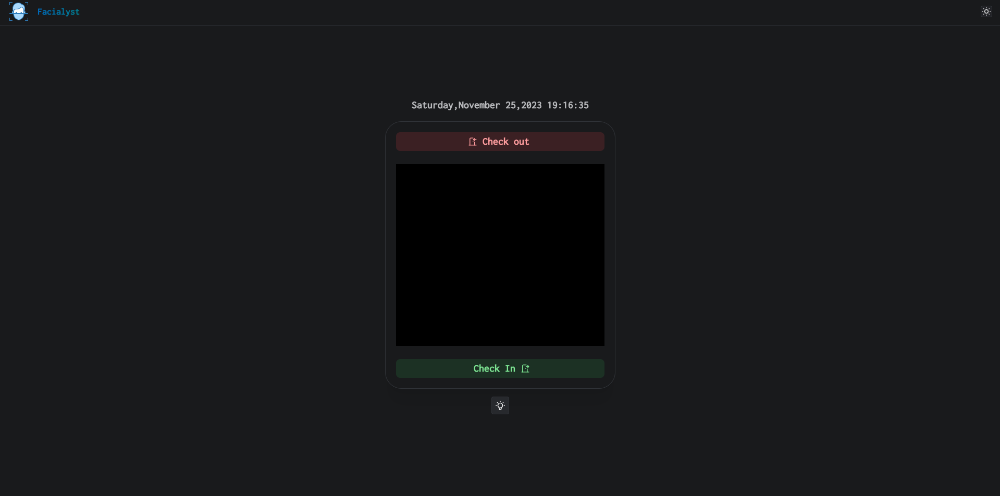
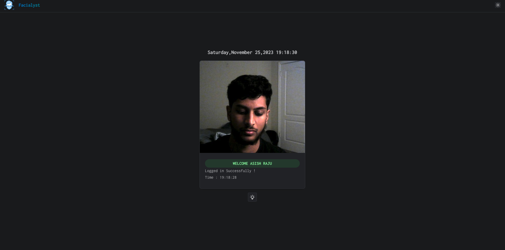
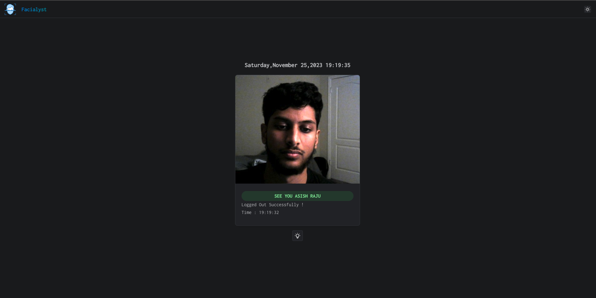
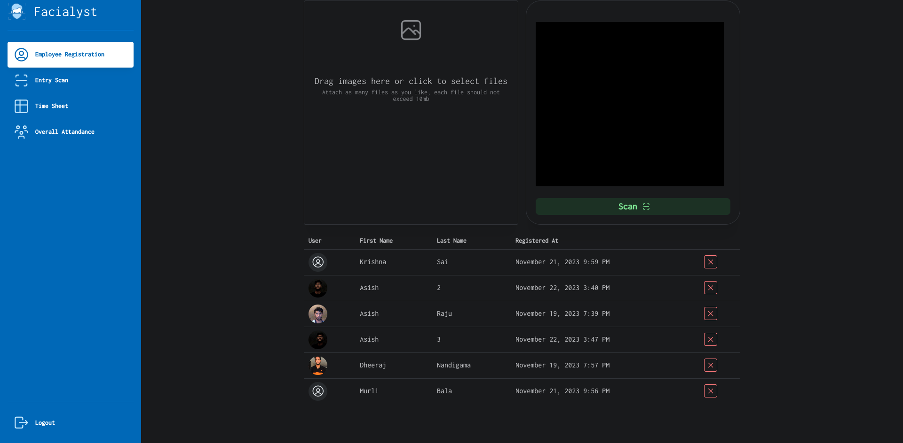
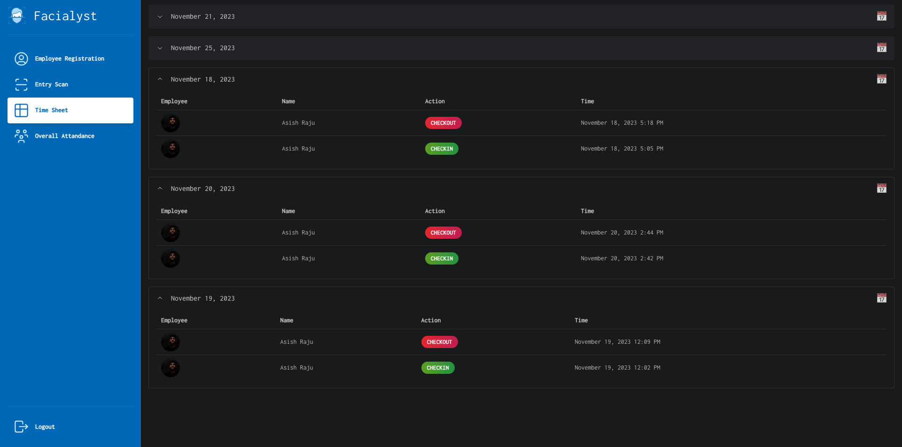
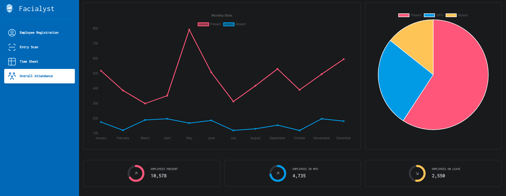

# Facialyst - CMPE 281 P2
*	University Name: San Jose State University http://www.sjsu.edu/ 
*	Course: [Cloud Technologies](http://info.sjsu.edu/web-dbgen/catalog/courses/CMPE281.html)
*	Professor: [Sanjay Garje](https://www.linkedin.com/in/sanjaygarje/)
*	Student: [Dheeraj Nandigama](https://www.linkedin.com/in/dheeraj-nandigama/) | [Puja Kumari](https://www.linkedin.com/in/pujakumari30/) | [Asish Raju](https://www.linkedin.com/in/asishraju/)

### Project Introduction

Facialyst, an innovative facial recognition system designed for efficient employee attendance tracking and insightful analysis, seamlessly integrates with established attendance management tools. Leveraging AWS Rekognition service to recognization facial features. The project benefits from robust cloud infrastructure to provide authentication, statistics and employee logs all added to a clean and elegent modern UI. This project is the 3 tier web application using various AWS service resources. The application manages various components to provide a highly available, scalable, cost effective solution to securely back up data on to Amazon S3 and CloudFront.

### Demo
Youtube Video: [Facialyst Demo]()

Web Application: [Live Link]()

### AWS Architecture of the project


### AWS Components to be setup

#### AWS Rekognition

- Create a collection called employees in aws rekognition to detect facial values and generate rekognition id on each image upload.

#### EC2: 

- Launch an EC2 instance and install Node.js and Nginx as the web server.
- Clone the project from Git repositories onto the EC2 instance.
- Configure the Nginx web server.
- Create an Amazon Machine Image (AMI) of the configured EC2 instance.
- Utilize the created AMI for spawning new EC2 instances through Auto Scaling policies in the future.

#### AutoScaling Group: 

- Set up an auto-scaling policy to ensure high availability and scalability for the system.
- Configure the application to scale with a desired instance count of 1 and a maximum instance count of 2.
- Enable flexibility by allowing adjustments to auto-scaling policy parameters, such as CPU utilization, network in/out, data rates, etc.

#### S3: 

- Establish two S3 buckets for the storage and management of face images belonging to employees and visitors scanned by our web app.
- Apply a lifecycle policy to the bucket storing visitors' images, allowing for the movement of these images to the S3 Standard Infrequent Access storage class after a specified duration.
- Configure the S3 Standard Infrequent Access storage class with a maximum duration of 30 days for objects to remain in this storage class.
- Implement Transfer Acceleration for the S3 bucket to ensure secure and accelerated data transfer with optimized data rates for files.
- Utilize AWS Glacier as the storage class for the S3 bucket, designating it as a cold storage solution, and set up a configuration to transfer files to Glacier after a period of 365 days.

#### DynamoDB: 

- Create 2 DynamoDB instance 
- Employees dynamodb used to keep all employees related data along with aws rekognition id to match employees scanned images
- Visitor dynamodb to keep log of all the employees metadata on their check in and checkout dates. This data is later on retrieved for statistics and compute purpose.


#### Route 53: 
- This is the Domain Name Server which is used to resolve the IP address of the application domain.


#### Lambda: 

- Set up 2 lambda functions powered by python3

- One lambda for serving all basic endpoints used to send and retrieve data from dynamodb

- Other lambda connected to S3 to build AWS Rekognition id from the S3 image uploaded.


#### Amazon Cognito: 

- Create the userpool for admins to sign up or sign in to the application dashboard using custom login/signup.

### Instructions to run project locally
Prerequisite Softwares: NodeJS

```
git clone https://github.com/dheerajnandigama/facialyst.git
npm install
npm start
```
### Sample Screenshots
Employee Attendance Page


Employee Attendance Check-in Page


Employee Attendance Check-Out Page


Employee Registration Page


Employee Timesheet


Employee Overall Stats
